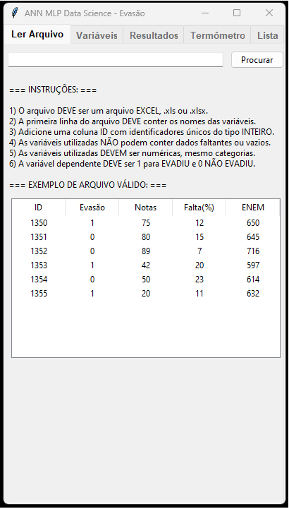

<p align="center">
  <a href="https://devfel.com/" rel="noopener">
 </a>
</p>

# 📊 FicaUAI - Fica University Artificial Intelligence 📈

ANN MLP Data Science - Evasão - This application provides a graphical user interface (GUI) for managing and analyzing student data to predict dropout rates using an Artificial Neural Network (ANN) with a Multilayer Perceptron (MLP).

<p align="center"> 
The interactive interface and all the tabs that you can use in the system.</p>

  <p align="center">
    </a>
  </p>

## 🌟 Features

- Load and validate structured student data from Excel files.
- Configure model parameters and select covariates for dropout predictions.
- Display detailed results and metrics including confusion matrices and accuracy.
- Save and export enriched data with dropout probabilities back to Excel.
- Change real student data and create new hypothecal scenarios to predict dropout rates.
- List all non-dropout students and their probabilities to identify potential risks.

## ⚙️ Installation and Setup

1. **Clone the Repository**:
   Begin by cloning the repository to your local machine:

   ```bash
   git clone https://github.com/devfel/FicaUAI.git
   ```

2. **Navigate to the Directory**:

   ```bash
   cd FicaUAI
   ```

3. **Install the Required Libraries**:
   Ensure you have the required libraries installed:
   ```bash
   pip install numpy pandas scikit-learn pillow tk_tools tkinter
   ```

## 🚀 Getting Started

1. Execute `gui.py` to open the graphical interface. "py gui.py" or "python gui.py"
2. Follow the GUI prompts to load data, configure the model, and view results.

## 📖 Usage Examples

- **Load Data**:
  Load your student data through the GUI and ensure it meets the format requirements.
- **Run Predictions**:
  Configure the model parameters and run the prediction model.
- **Save and Export**:
  Save the results and predictions back into an Excel file with the added probabilities.

## 🔥 Execution

To run the program, navigate to the project's main directory and execute:

```bash
python gui.py
```

## 🔧 Requirements

- Python 3.x
- Libraries: numpy, pandas, scikit-learn, tkinter, tk_tools, pillow
- Excel files for data input/output

## 📂 Directory Structure

- `input/`: Directory to place your input Excel files.
- `output/`: Directory where the enriched Excel files will be saved.
- `gui.py`: Main script to launch the GUI.
- `main.py`: Backend script handling data operations and model training.

## 🙌 Contribution

Feel free to fork the project, open issues, and provide pull requests.

## 📜 License

This project is licensed under the MIT License.
